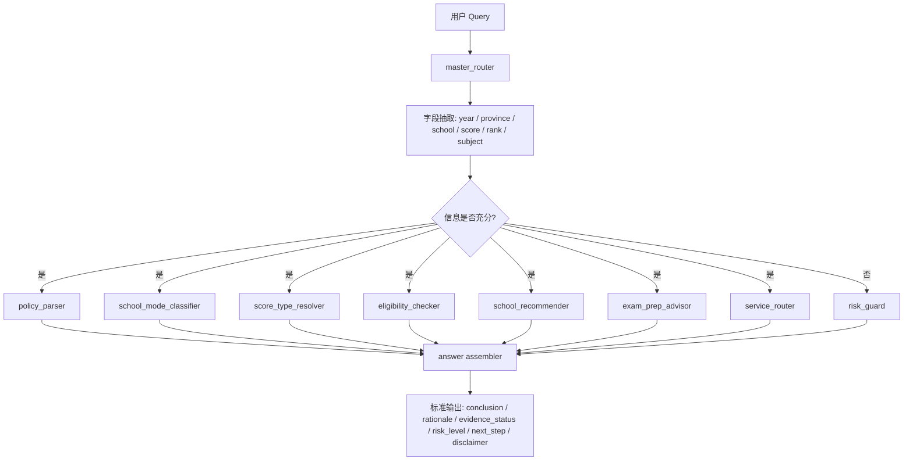
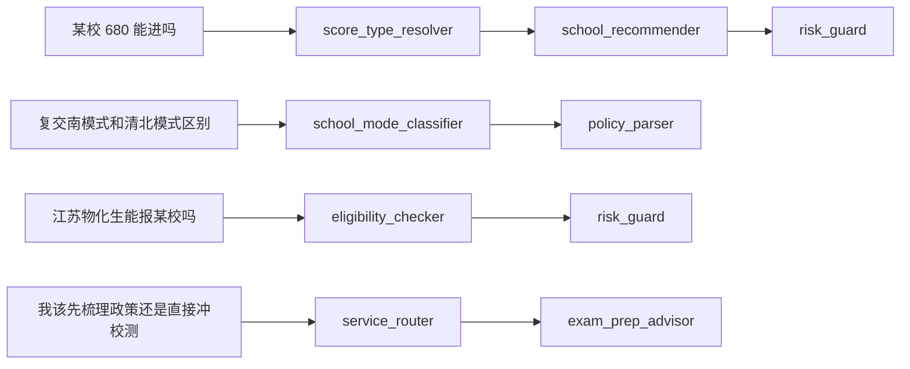

# zhumeng-qiangji-skill

> A domain-specific AI skill repository for China’s Strong Foundation Plan (强基计划)

`zhumeng-qiangji-skill` 不是网站项目，不是前后端产品，也不是一个“问一句答一句”的 RAG demo。
它的定位是一个面向强基计划垂直场景的 `AI skill repository`，用于沉淀：

- system prompt
- domain instructions
- routing rules
- terminology constraints
- guardrails
- few-shot examples
- evaluation cases
- knowledge schema
- future RAG / tool integration contracts

这个仓库的核心目标，不是“让模型知道一点强基知识”，而是让模型在一个：

- 年份高度敏感
- 省份高度敏感
- 模式差异显著
- 分数口径极易混淆
- 错误成本较高

的领域里，学会 `先判断，再回答；先校验，再输出；证据不足时主动降级，而不是编造。`

---

## 项目定位

### What it is

`zhumeng-qiangji-skill` 是“逐梦清北”强基计划智能顾问能力底座的第一层。

它承担的是：

- 规则层
- 路由层
- 术语层
- 风险控制层
- 结构化输出层

### What it is not

它不是：

- 一个招生信息网站
- 一个通用聊天机器人前端
- 一个纯 prompt 仓库
- 一个只靠向量检索拼答案的 RAG 项目

### 适用方向

这个仓库未来可作为以下方向的共用底座：

- ChatGPT 自定义 GPT / Skills
- Claude Skills 风格技能仓库
- 后续 RAG 系统的策略层与规则层
- “逐梦清北”品牌下的强基计划智能顾问
- 后续扩展的数据平台、咨询助手、服务转化助手

---

## 为什么强基计划需要 Skill Repository

强基计划不是普通招生问答场景。它的困难不只是“知识点多”，而是“规则密度高且容易错”。

### 这个领域的难点

- `年份强依赖`
  - 很多结论跨年份就会失效。
- `省份强依赖`
  - 招生专业、计划、省份覆盖、选科限制、入围规则都可能不同。
- `模式强分化`
  - 清北风格、复交南风格、出分前校测、出分后校测不能混着说。
- `分数口径高混淆`
  - 高考裸分、入围线、录取线、综合成绩、加权成绩、校测成绩经常被误解。
- `错误成本高`
  - 错推荐、错判断、错解释，都会直接影响家庭决策和咨询结果。

### 通用模型常见错误

- 把“综合成绩 780”当“高考裸分 780”
- 把“加权入围成绩”当“高考裸分”
- 把复交南模式说成“所有学校统一入围线”
- 把“报名成功直接参加校测”扩展成所有学校通用规则
- 缺少年份却直接给最终结论
- 缺少省份却直接输出择校名单
- 没有可靠来源却说成“官方规定”
- 把“只考面试”误说成“更容易录取”

所以这里需要的不是更多自由发挥，而是更强的：

- 显式路由
- 显式约束
- 显式降级
- 显式评测

---

## 本仓库解决什么问题

本仓库聚焦在强基计划 AI 能力底座的第一阶段：

1. 统一领域术语和输入字段
2. 识别用户问题属于哪种类型
3. 将问题路由到对应 skill
4. 对高风险结论执行 guardrails
5. 输出带有 `evidence_status / risk_level / next_step / disclaimer` 的结构化回答
6. 为未来接入真实知识库、RAG、咨询工作流预留稳定接口

一句话概括：

> 它教模型在强基计划领域“该怎么想、该怎么分流、该怎么保守地说、该怎么避免胡编”。

---

## 核心设计原则

1. `先判断，再回答`
   - 先识别问题类型和关键字段，再决定是否进入回答。
2. `结构化优先`
   - 能用 schema、规则、taxonomy 表达的，不放任模型自由脑补。
3. `年份优先`
   - 涉及政策、录取、入围、模式细节的结论优先绑定年份。
4. `省份优先`
   - 涉及资格判断和择校建议时，缺省份必须降级。
5. `分数类型必须消歧`
   - 数字不能默认当裸分。
6. `不确定就明说`
   - `uncertain` 和 `missing_reliable_source` 不是弱点，是正确行为。
7. `可解释输出`
   - 结论之外，还要给依据、风险、下一步。
8. `风险拦截内建`
   - 高风险断言不能靠“模型自觉”，要靠规则层兜底。

---

## 为什么不是简单 RAG

RAG 擅长解决“去哪里找资料”，但强基计划里更难的问题往往是：

- 这是不是一个必须先补年份的问题？
- 没有省份时能不能给学校名单？
- 这个分数到底是裸分、综合成绩还是加权成绩？
- 这个学校是不是复交南风格？
- “报名成功直接参加校测”是否只适用于部分院校？
- 当前缺的不是知识，还是缺判断边界？

也就是说：

- `RAG 解决 retrieval`
- `本仓库解决 routing + reasoning policy + risk policy`

未来 RAG 应该接在这个仓库下面，而不是替代这个仓库。

---

## 为什么不是普通 Prompt 集合

如果只有 prompt，而没有 skill 边界、schema、rules 和 eval，会出现几个问题：

- 不可评测
- 不可复用
- 不可解释
- 不可维护
- 不可迁移

本仓库把这些能力拆成独立层：

- `prompts/`
  - 负责指导模型如何思考和表达
- `skills/`
  - 负责定义任务边界和输入输出
- `schemas/`
  - 负责定义结构化契约
- `rules/`
  - 负责定义不可违反的领域 guardrails
- `knowledge/`
  - 负责定义 taxonomy、glossary 与 mock object shape
- `evals/`
  - 负责做回归检查和幻觉压测

---

## System Architecture



---

## Skill Routing 示意



---

## Query → Route → Output 示例

### 示例 1：分数歧义型问题

**输入**

> 江苏考生，2026 届，物化生，想问复旦强基 675 能不能进？

**预期路由**

- `score_type_resolver`
- `school_recommender`
- `risk_guard`

**正确处理方式**

- 先识别 `675` 是什么分数类型
- 若未说明是裸分 / 位次对应分 / 预估分，则先降级
- 不得直接输出“能进 / 不能进”

**预期输出约束**

- 结论必须说明当前不稳定点
- 必须提示需要补充的字段
- 若只能做保守建议，使用：
  - `可尝试`
  - `可重点关注`
  - `不能确认`
  - `风险较高`

### 示例 2：模式泛化型问题

**输入**

> 强基是不是所有学校都报名成功直接参加校测？

**预期路由**

- `school_mode_classifier`
- `policy_parser`
- `risk_guard`

**正确处理方式**

- 必须说明这只适用于部分模式和部分院校
- 不得把它说成所有学校通用规则

### 示例 3：策略型问题

**输入**

> 我不太擅长笔试，但表达还可以，有哪些只考面试的强基院校值得关注？

**预期路由**

- `school_mode_classifier`
- `exam_prep_advisor`
- `school_recommender`
- `risk_guard`

**正确处理方式**

- 可以给策略层建议
- 但不能把“只考面试”说成“更容易录取”
- 如果缺年份、省份，则不要输出学校级确定结论

---

## Skill 列表

| Skill | 主要职责 | 输入重点 | 输出重点 | 典型问题 |
| --- | --- | --- | --- | --- |
| `policy_parser` | 解析政策对象与规则边界 | year, school_name, province | policy conclusion, evidence_status | 某校某年是否招生？ |
| `school_mode_classifier` | 判断模式、比较模式 | school_name, year, mode terms | mode explanation, caution | 复交南模式和清北模式区别？ |
| `score_type_resolver` | 消解分数类型歧义 | score, raw query context | resolved_score_type, needs_clarification | 680 能进吗？ |
| `eligibility_checker` | 判断是否具备基本报名条件 | province, subject_selection, year | eligibility status, missing_fields | 江苏物化能报吗？ |
| `school_recommender` | 做保守择校建议分层 | year, province, score / rank | recommendation band, candidate scope | 按这个分数适合冲哪些学校？ |
| `exam_prep_advisor` | 输出备考与投入建议 | baseline, target stage, school hints | prep focus, next action | 没有竞赛基础还值得准备吗？ |
| `service_router` | 将问答意图转成服务动作 | clarity, urgency, consultation_stage | recommended_service_type | 我该先做什么？ |
| `risk_guard` | 拦截高风险幻觉与过度结论 | candidate answer + query context | blocked, violations, downgrade actions | 直接告诉我今年能不能录？ |

---

## Gold Rules

在现有版本里，仓库已经把一批“强基计划金规则”沉淀成文档和规则层，核心包括：

- 强基至少存在多种不同入围路径，不能一概而论
- `加权后高考成绩` 不等于 `高考裸分`
- “报名成功直接参加校测”只适用于部分院校和部分模式
- “只考面试”不等于“更容易录取”
- 综合成绩公式不能脱离 `school_name + year`
- 录取判断不能忽视体测、校测合格线、特招线等前置条件
- 破格规则高度年份敏感
- 校测时间决定准备节奏和策略
- 强基不仅是录取问题，也是长期培养路径问题

相关文件：

- [docs/gold_rules.md](docs/gold_rules.md)
- [rules/admissions_pathways.yaml](rules/admissions_pathways.yaml)
- [knowledge/taxonomy/admission_pathways.yaml](knowledge/taxonomy/admission_pathways.yaml)
- [knowledge/taxonomy/student_fit_profiles.yaml](knowledge/taxonomy/student_fit_profiles.yaml)

---

## Guardrail Philosophy

本仓库的 guardrail 不是“拒答一切”，而是：

- 在该保守的时候保守
- 在该降级的时候降级
- 在该要求补字段的时候要求补字段
- 在该提醒风险的时候提醒风险

### 重点拦截场景

- 把综合成绩当高考裸分
- 把加权入围成绩当高考裸分
- 对复交南模式默认输出“统一入围线”
- 把“报名成功直接参加校测”说成所有院校通用规则
- 把“只考面试”误说成“更容易录取”
- 缺少年份时直接下政策结论
- 缺少省份时直接输出择校名单
- 无可靠来源却输出具体数值类录取判断

### 输出策略

- `block`
  - 明显错误或高风险幻觉，直接拦截
- `downgrade`
  - 可以给保守建议，但不能给最终结论
- `pass_with_warning`
  - 可回答，但必须附带免责声明

---

## 结构化协议

本仓库默认要求回答尽量对齐 `schemas/answer.schema.json`，关键字段包括：

- `summary`
- `question_type`
- `route`
- `conclusion`
- `rationale`
- `evidence_status`
- `confidence`
- `risk_level`
- `next_step`
- `disclaimer`

其中 `evidence_status` 推荐值：

- `official_verified`
- `structured_record`
- `inferred_with_constraints`
- `uncertain`
- `missing_reliable_source`

这意味着仓库不鼓励“像知道一样地说”，而鼓励“连不确定性也结构化表达”。

---

## 仓库结构

```text
zhumeng-qiangji-skill/
├── README.md
├── docs/                # 产品定位、架构、术语、guardrails、路线图
├── skills/              # 每个 skill 的定义、schema、决策规则、few-shot
├── prompts/             # system prompt、router prompt、各 skill prompt
├── schemas/             # 核心输入输出协议
├── rules/               # 路由规则、分数 guardrails、年份/省份敏感性、模式约束
├── knowledge/           # taxonomy / glossary / mock objects / student fit profile
├── examples/            # 典型问法、期望输出、失败样例
├── evals/               # benchmark / hallucination / routing / scoring
├── scripts/             # 本地可运行 demo 和校验脚本
├── src/                 # 极简 Python 路由与 guardrail 实现
└── tests/               # pytest 回归测试
```

---

## 快速开始

### 1. 安装依赖

```bash
pip install -r requirements.txt
```

### 2. 校验 schema

```bash
python scripts/validate_schemas.py
```

### 3. 运行路由 demo

```bash
python scripts/run_router_demo.py "江苏考生，2026 届，物化生，想问某校 680 能不能进"
```

### 4. 运行 guardrail demo

```bash
python scripts/run_guardrail_demo.py \
  --query "强基是不是所有学校都报名成功直接参加校测" \
  --answer "对，所有强基学校都是报名成功就直接进校测。"
```

### 5. 运行测试

```bash
pytest
```

---

## 本地脚本说明

### `scripts/run_router_demo.py`

输入一句用户问题，输出：

- 抽取出的上下文字段
- 识别出的 `question_type`
- 推荐路由到哪些 skill
- 缺失哪些关键字段
- 当前风险标记

### `scripts/run_guardrail_demo.py`

输入：

- 用户 query
- 一个候选回答

输出：

- 是否应拦截
- 违反了哪些规则
- 需要执行哪些降级动作

### `scripts/validate_schemas.py`

校验：

- `schemas/*.json`
- `skills/*/input_schema.json`
- `skills/*/output_schema.json`

### `scripts/lint_repo.py`

做一个极简的仓库完整性检查，确保关键文件存在、mock 数据带免责声明。

---

## 评测与回归

本仓库通过三层机制约束输出质量：

### 1. Schema Layer

- 定义输入输出结构
- 避免关键字段完全丢失

### 2. Rule Layer

- 显式表达年份、省份、模式、分数类型、证据状态相关规则

### 3. Eval Layer

- 用 benchmark 和 hallucination case 做行为回归

当前评测重点包括：

- 路由是否正确
- 是否触发不确定性策略
- 是否把综合成绩 / 加权成绩误当裸分
- 是否误判学校模式
- 是否在无证据时编造具体线差或录取结论

---

## 如何扩展

### 新增一个 skill

建议同时新增：

1. `skills/<skill_name>/SKILL.md`
2. `skills/<skill_name>/input_schema.json`
3. `skills/<skill_name>/output_schema.json`
4. `skills/<skill_name>/decision_rules.md`
5. `skills/<skill_name>/fewshot.md`
6. 对应 `prompts/<skill_name>.md`
7. 相应的 benchmark / hallucination case

### 新增一条领域规则

建议同时修改：

1. `rules/*.yaml`
2. `docs/guardrails.md` 或 `docs/gold_rules.md`
3. `examples/failure_cases.md`
4. `evals/hallucination_cases.yaml`
5. `tests/`

### 新增真实知识层

建议按 `school_name x year x province` 三维结构扩展，不要直接把不同年份或不同省份的规则混写到一起。

---

## 使用场景

### 场景 1：ChatGPT 自定义 GPT

- `prompts/system_prompt.md` 可作为系统提示主干
- `prompts/master_router.md` 可作为内部路由器
- `rules/` 可转写为不可违反的领域约束

### 场景 2：Claude Skills

- `skills/*/SKILL.md` 可以直接转成 skill description
- `schemas/` 可作为结构化输出契约
- `risk_guard` 可作为全局兜底 skill

### 场景 3：未来 RAG 系统

- 本仓库负责“先怎么判断、怎么降级、怎么解释”
- 外部知识库负责“提供具体年份/学校/省份证据”

---

## 版本路线

### v0.1

- 初始化 skill repository 骨架
- 建立 prompts / schemas / rules / evals / mock knowledge
- 提供本地 router / guardrail demo

### v0.2

- 继续补强强基金规则和学生适配画像
- 引入更稳定的学校-年份-省份知识结构
- 为来源状态和更新时间建立标准字段

### v0.3

- 接入真实政策数据采集流程
- 引入 evidence citation contract
- 对接外部 RAG / 检索层

### v0.4

- 接入咨询服务工作流
- 引入服务分群与转化动作编排
- 扩展成完整的强基智能顾问能力平台

---

## 开源许可建议

当前仓库默认采用 `MIT License`，理由是：

- 便于社区复用工程结构、skill 设计方式、schema 组织方式
- 便于二次开发和二次适配
- 适合作为 AI skill repository 的通用底座

如果未来需要保留更强商业化空间，建议考虑：

- 代码和结构开源，真实数据与高价值评测集私有
- 或采用双许可证模式，对商业使用设置额外条款

---

## Disclaimer

- 本仓库中的 `knowledge/mock/`、部分案例、部分 taxonomy 与策略规则仅用于结构展示和能力设计，不代表真实、完整、最新的官方政策结论。
- 强基计划属于 `高年份敏感 + 高省份敏感 + 高口径混淆风险` 领域，任何学校级、年份级、分省级最终结论均应以目标高校当年官方简章、各省招办信息及正式发布材料为准。
- 本仓库定位为 `规则层 + 策略层 + skill layer`，不是官方政策替代品。

