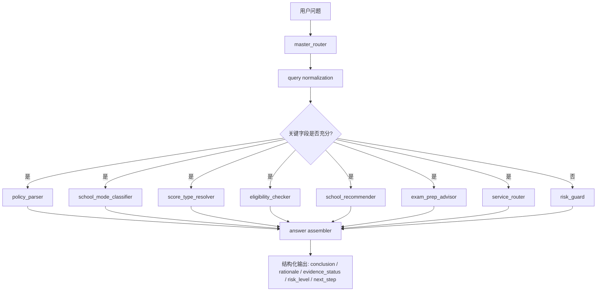
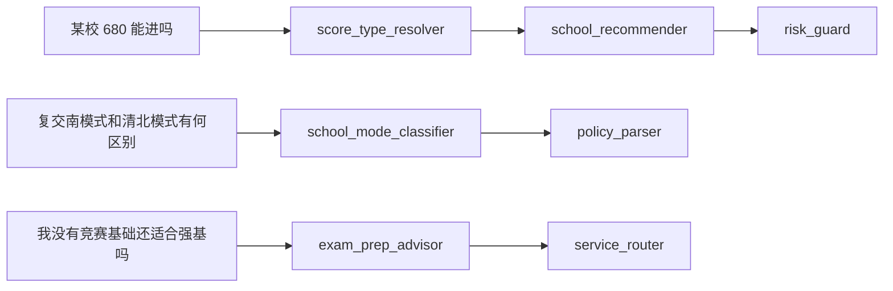

# zhumeng-qiangji-skill

> A domain-specific AI skill repository for China’s Strong Foundation Plan (强基计划)

`zhumeng-qiangji-skill` 不是网站项目，不是普通知识库，也不是一组零散 prompt。
它是一套面向“强基计划”垂直场景的 AI skill repository，用来沉淀：

- system prompt
- domain instructions
- routing rules
- terminology constraints
- guardrails
- few-shot examples
- evaluation cases
- mock knowledge schema
- future RAG / tool integration contracts

仓库目标不是“让模型知道一点强基信息”，而是让模型在一个高规则密度、高年份敏感、高省份敏感、高概念混淆风险的场景中，学会：

- 先分类，再回答
- 先判断信息是否充分，再决定是否给结论
- 严格区分年份、省份、学校模式、分数类型
- 在没有可靠依据时明确降级，而不是编造

## 为什么“强基计划”适合做成 Skill Repository

强基计划问答不是普通招生答疑。它天然具备以下特征：

- `年份强依赖`：很多结论跨年份会失效。
- `省份强依赖`：招生专业、计划、选科限制、入围规则可能随省份变化。
- `术语高混淆`：高考裸分、入围线、录取线、综合成绩、校测成绩很容易被混为一谈。
- `学校模式差异大`：清北模式、复交南模式、出分前校测、出分后校测不能混用。
- `错误成本高`：错误推荐院校、错误解读政策、错误判断可报资格，都会直接影响咨询判断。

这意味着，单纯依赖“大模型 + 随机 prompt”不够稳定；单纯做 RAG 也不够，因为问题不只是“缺知识”，而是“缺规则、缺边界、缺分流”。

## 本仓库解决什么问题

本仓库聚焦在强基计划 AI 能力底座的第一层：

- 统一领域术语和结构化字段
- 将用户问题路由到合适的 skill
- 用 guardrails 拦截高风险推断
- 为未来接入 RAG、数据库、咨询工作流预留接口
- 为 ChatGPT 自定义 GPT、Claude Skills、私有智能顾问系统提供可迁移的规则层

适用方向包括：

- ChatGPT 自定义 GPT / Skills 的底座
- Claude Skills 风格的技能仓库
- 后续接入 RAG 时的策略层与规则层
- “逐梦清北”品牌下的强基计划智能顾问能力底座
- 未来扩展为数据平台、咨询助手、服务转化助手

## 典型错误案例

通用模型在该领域常见失误包括：

- 把“综合成绩 780”理解成“高考裸分 780”
- 把复交南模式学校说成“统一入围线学校”
- 缺少年份时直接给出确定结论
- 缺少省份时直接输出择校名单
- 把没有官方来源的信息说成“确定政策”
- 用某一年的规则硬迁移到另一年

本仓库的核心设计，就是把这些错误前置为可检查、可评测、可维护的规则。

## Skill Architecture



## Skill Routing 示意



## Query → Route → Output 示例

**输入问题**

> 江苏考生，2026 届，物化生，想问复旦强基 675 能不能进？

**预期路由**

- `score_type_resolver`
- `school_recommender`
- `risk_guard`

**预期输出约束**

- 先识别 `675` 是否为高考裸分、预估分、位次对应分，若未明确则先降级
- 若无可靠来源，不得给出“能进 / 不能进”的确定性结论
- 结论中必须说明：
  - 当前信息不足点
  - 需要补充的字段
  - 若仅做初筛，可给出“可尝试 / 可重点关注 / 不能确认 / 风险较高”级别建议

## 为什么不是简单 RAG

RAG 解决的是“检索到什么”，但强基计划更关键的问题是：

- 应该先问什么字段
- 哪些问题缺少年份不能回答
- 哪些问题缺少省份只能降级
- 哪些数字不能直接当裸分
- 哪些学校不能默认套统一入围线逻辑

也就是说，这个仓库更像是 `policy layer + reasoning policy + risk layer`，RAG 未来只会接在它下面，不会替代它。

## 为什么不是普通 Prompt 集合

普通 prompt 集合的问题是：

- 不可评测
- 不易维护版本差异
- 缺少结构化 schema
- 缺少 guardrail 执行逻辑
- 无法明确区分 skill 输入输出边界

本仓库把 prompt、rule、schema、few-shot、eval case、mock knowledge 放在同一个工程里，目的是让能力可以演化、测试和迁移。

## Skill 列表

| Skill | 作用 | 典型问题 |
| --- | --- | --- |
| `policy_parser` | 解析政策类问题，识别年份/学校/模式/规则对象 | “某校某年是否有强基招生？” |
| `school_mode_classifier` | 识别学校属于何种模式，避免模式混淆 | “复交南模式和清北模式区别？” |
| `score_type_resolver` | 识别分数类型，防止把综合分当裸分 | “680 能进吗？” |
| `eligibility_checker` | 判断报名条件是否具备 | “江苏物化能报吗？” |
| `school_recommender` | 在信息充分前提下给出保守择校建议 | “按这个分数适合冲哪些学校？” |
| `exam_prep_advisor` | 输出校测准备与备考策略建议 | “没有竞赛基础还值得准备吗？” |
| `service_router` | 把咨询问题分流到产品/服务动作 | “我适合先做政策梳理还是校测冲刺？” |
| `risk_guard` | 对高风险输出做降级、补充免责声明与拦截 | “直接告诉我今年能不能录？” |

## 核心设计原则

1. `先判断，再回答`
2. `结构化优先`
3. `年份优先`
4. `省份优先`
5. `分数类型严格区分`
6. `不确定就明确说不确定`
7. `可解释输出`
8. `风险拦截内建`

## 仓库结构

```text
zhumeng-qiangji-skill/
├── docs/                # 架构、路由、术语、评测、路线图
├── skills/              # skill 定义、输入输出 schema、决策规则、few-shot
├── prompts/             # 系统提示、路由提示、各 skill 专用提示
├── schemas/             # 跨 skill 的结构化契约
├── rules/               # 可读性优先的领域 guardrails / routing rules
├── knowledge/           # taxonomy / glossary / mock data
├── examples/            # 典型用户问题、期望输出、失败样例
├── evals/               # benchmark / hallucination / routing case
├── scripts/             # 本地最小验证脚本
├── tests/               # pytest 回归测试
└── src/                 # 极简 Python 逻辑实现
```

## 快速开始

### 1. 安装依赖

```bash
pip install -r requirements.txt
```

### 2. 运行 schema 校验

```bash
python scripts/validate_schemas.py
```

### 3. 运行路由 demo

```bash
python scripts/run_router_demo.py "江苏考生，2026 届，物化生，想问某校 680 能不能进"
```

### 4. 运行 guardrail demo

```bash
python scripts/run_guardrail_demo.py \
  --query "某校 680 能进吗" \
  --answer "可以进，复交南模式学校都有统一入围线，680 基本稳。"
```

### 5. 运行测试

```bash
pytest
```

## 使用示例

### Router Demo

```bash
python scripts/run_router_demo.py "复交南模式和清北模式有什么区别"
```

预期结果：

- 识别 `question_type = school_mode`
- 推荐 skill：`school_mode_classifier`、`policy_parser`
- 若未给年份，则标记 `need_year = true`

### Guardrail Demo

```bash
python scripts/run_guardrail_demo.py \
  --query "上海考生，2026，某校 675 能不能进" \
  --answer "能进，今年录取线就是 675。"
```

预期结果：

- 命中“具体数值结论缺证据”规则
- 命中“高风险确定性表述”规则
- 返回 `blocked = true`

## 评测与 Guardrails

仓库通过三层机制控制幻觉：

- `schema layer`
  - 要求输入输出字段完整且可验证
- `rule layer`
  - 用 YAML 显式表达年份、省份、模式、分数类型相关约束
- `eval layer`
  - 用 benchmark cases 与 hallucination cases 做回归检查

重点 guardrails 包括：

- 禁止把综合成绩当成高考裸分
- 对复交南模式学校，不能默认输出“统一入围线”
- 缺少年份时，不允许直接下最终结论
- 缺少省份时，择校建议必须降级
- 没有可靠来源时，必须显式标记 `uncertain` 或 `missing_reliable_source`

## Roadmap

### v0.1

- 建立 skill repository 骨架
- 定义 prompts / schemas / rules / evals
- 提供本地 demo router 与 guardrail checker

### v0.2

- 接入真实政策数据采集流程
- 为 school / province / year 建立版本化知识结构
- 引入更严格的输出评分器

### v0.3

- 对接外部 RAG / 检索系统
- 引入证据引用格式与来源置信度
- 支持咨询工作流与服务转化路由

## License 建议

当前仓库默认附带 `MIT License`，理由是：

- 有利于社区复用工程结构、prompt 组织方式与 schema 设计
- 方便作为 AI skill repository 的公共底座被二次开发

如果未来希望保留更强的商业化控制，可以考虑：

- 保持代码和结构开源，但将高价值数据、标注集、评测集设为私有
- 或改用双许可证模式，对商用使用增加附加条款

## Disclaimer

- 本仓库内 `knowledge/mock/` 与部分案例数据均为 `demo/mock`，仅用于展示结构设计，不代表真实、完整、最新的官方政策结论。
- 强基计划属于高年份敏感、高省份敏感领域，任何具体结论均应以目标高校当年官方简章、各省招办信息与正式发布材料为准。
- 本仓库的定位是 `规则层 + 策略层 + skill layer`，不是官方政策替代品。

